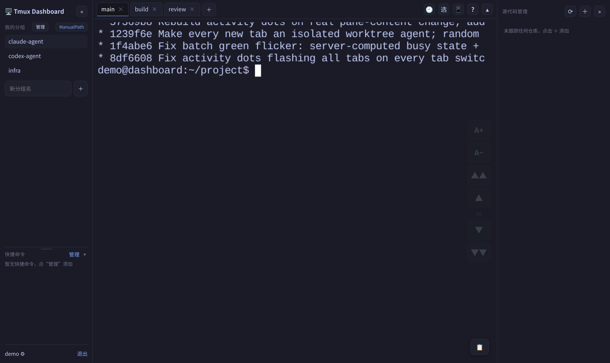
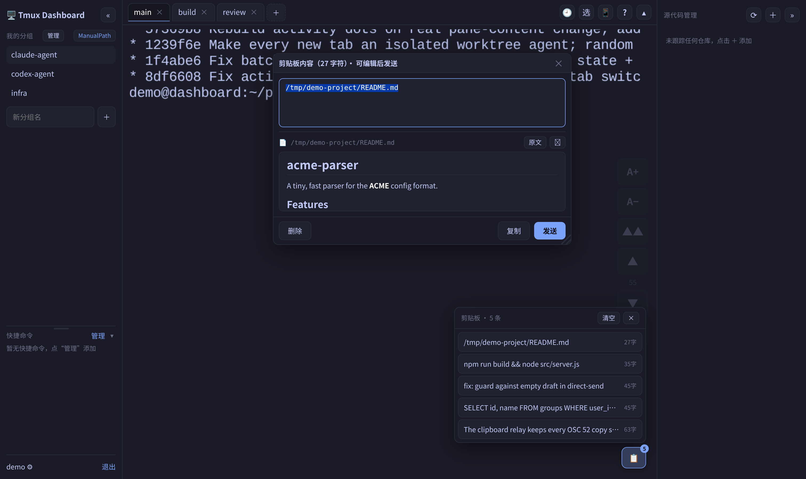
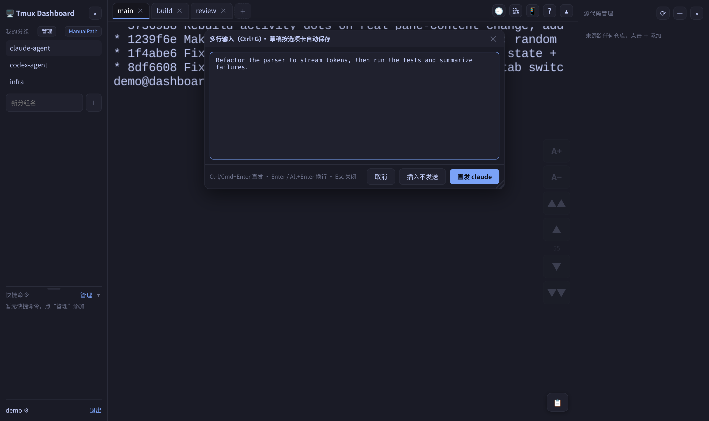

<div align="center">

**English** · [简体中文](README.zh-CN.md)

# tmux_claude_codex_dashboard

**A self-hosted, browser-based tmux console for running & babysitting long-lived CLI coding agents — Claude Code, Codex, or any shell — from your desktop or your phone.**




</div>

## Why

Long-lived coding agents (Claude Code, Codex) still need a human in the loop — but you're rarely sitting at the box they run on. This puts every agent in a **browser tab**: named **groups → tabs** over real tmux windows, so you can glance in, paste context, grab their output, and nudge them from anywhere on your LAN — even your phone — while the processes keep running on the host.

## Quick start

> **Runs natively on the host — not in Docker.** The terminals, tmux, and the `claude` / `codex` you launch all run as your system user, reusing your existing `~/.claude` login and full filesystem access — exactly what babysitting real agents needs. A container would wall the agent off from your projects and credentials.

**Requires:** Node 20 · tmux 3.2+ · git

```bash
git clone https://github.com/physic-gun/tmux_claude_codex_dashboard.git
cd tmux_claude_codex_dashboard

(cd server && npm install)                    # backend deps (compiles native modules)
(cd client && npm install && npm run build)   # client build (served by the backend)

cd server && node src/server.js               # → http://<lan-ip>:6880
```

On first boot a random **admin** password is printed to the log. Open `http://<lan-ip>:6880` and log in. To pin your own credentials, `cp .env.example .env` and set `ADMIN_PASSWORD` (and optionally `JWT_SECRET`) before starting.

## Features

|  | Feature | What it does |
|---|---|---|
| 🗂️ | **Groups → tabs** | Each user gets named groups (one long-lived tmux session each); tabs are tmux windows. Close a tab and it just backgrounds — the process keeps running — reopen or kill it later. |
| 📋 | **Clipboard relay** | Captures every terminal **OSC 52** copy (Claude's `/copy`, select-to-copy) straight from the stream, so nothing is lost even when the browser blocks the system clipboard. One tap to refill or send it back. |
| 📄 | **File preview** | Copy a file path (absolute, or relative to the agent's working dir) and its contents open in a read-only split — with Markdown rendering and a pop-out reader. |
| 📁 | **File explorer** | A draggable file manager (📁 button) anchored to the pane's working dir: browse folders, one-click **copy path** or **send it to the agent**, preview text/Markdown, `cd`, and create / rename / delete / **upload (drag-drop)** / download. An address bar jumps to any path. |
| 🖼️ | **Paste an image to the agent** | Paste (`Ctrl+V` / `Ctrl+Shift+V`) or drag an image into the terminal — it's uploaded to a server temp file and its path is injected into the prompt, so the agent auto-attaches it. Works on a headless host with no OS clipboard. |
| ⌨️ | **Direct-send composer** | `Ctrl+G` opens a draggable, resizable multi-line editor; insert as one paste, or **send straight to the agent** with `Ctrl+Enter`. Drafts autosave per tab. |
| 🌿 | **Git panel** | A side rail shows repo changes / "behind remote", with an inline diff viewer and commit · pull · push. |
| 🕘 | **Resume & archive** | One-click resume of a previous Claude session; periodic pane snapshots can help recover recent scrollback after a crash. |
| 📱 | **Mobile** | On-screen keyboard, one-finger drag-select-to-copy, and tap-without-popping-the-OS-keyboard — babysit agents from your phone. |
| 🔒 | **Auth & HTTPS** | JWT login with admin-managed users; optional self-signed HTTPS so the clipboard works across the LAN. |

## Recent updates (2026-07)

- **Agent-aware tab titles:** Claude keeps its OSC title; Codex CLI tabs resolve the exact root thread
  title from the rollout file opened by the pane and Codex's read-only state database. Linux and
  macOS are supported, and unavailable or duplicate titles fall back to the stable window name.
- **Process-aware wheel routing:** the server verifies the real foreground command. Claude with SGR
  mouse mode keeps native scrolling; Codex, shells, and other programs use viewer-local tmux
  copy-mode. Scroll, copy-mode cancellation, and immediate keyboard input are serialized so the
  first key after scrolling is not swallowed.
- **Lifecycle-safe systemd deployment:** `TMUX_MANAGED_EXTERNALLY=1`, `tmux -N`, and sibling Node/tmux
  units keep application reloads from owning or signaling the long-lived base panes.

## Screenshots

<table>
  <tr>
    <td width="50%"></td>
    <td width="50%"></td>
  </tr>
  <tr>
    <td align="center">Clipboard relay → file preview with live Markdown</td>
    <td align="center"><code>Ctrl+G</code> multi-line direct-send composer</td>
  </tr>
</table>

## Tech stack

`React` · `xterm.js` · `Express` · `node-pty` · `tmux` · `SQLite`

```text
Browser ──REST/WS──▶ Node service cgroup ──Unix socket──▶ persistent tmux service cgroup
                       Express + node-pty                  base panes + agents
```

Each terminal connection spins up a tmux *grouped session* as its own viewer client, so disconnecting kills only that viewer — the real windows and other viewers are untouched.

## Configuration

All optional — sensible defaults, secrets auto-generated on first boot.

| Var | Default | Notes |
|---|---|---|
| `PORT` | `6880` | Listen port |
| `HOST` | `0.0.0.0` | Listen address; set a specific LAN IPv4 to restrict exposure |
| `JWT_SECRET` | auto-generated & persisted | Empty → auto-generate a random key; set a fixed value (≥16 chars) to pin it |
| `ADMIN_USERNAME` / `ADMIN_PASSWORD` | `admin` / random | First-boot admin; empty password → random, printed to the log |
| `DB_PATH` | `./data/dashboard.db` | SQLite path |
| `TMUX_SOCKET` | `tmuxdash` | Dedicated tmux socket (isolated from your system tmux) |
| `TMUX_MANAGED_EXTERNALLY` | `false` | Set `true` when another service supervises tmux; Node clients add `-N` and never recreate a missing server in their own cgroup |
| `WORKSPACE_ROOT` | *(empty)* | New windows start in `<root>/<user>/<group>`; empty → tmux default dir |
| `TLS_CERT` / `TLS_KEY` | *(empty)* | Point both at a cert/key to serve HTTPS (wss) |
| `MAX_WINDOW_EXPANSION` | `50` | Upper bound for `name[[1-5]]` batch window creation |

## Run persistently

<details>
<summary><b>Linux (systemd, recommended)</b></summary>

Use the two templates under [`deploy/systemd/`](deploy/systemd/README.md): one foreground
`tmux -D` unit owns the base panes, while the Node unit only connects to its socket with `tmux -N`.
The dashboard unit uses `Wants=` and `After=` only; do not add `PartOf=`, `BindsTo=`, or stop
propagation to the tmux unit. The tmux template also uses `RefuseManualStop=yes` so an application
deployment cannot accidentally end every session. In externally managed mode, `/api/health` returns
503 when the tmux server is unavailable, so a live Node process is not mistaken for a healthy terminal service.

For a fresh install, render and verify both templates, install them, run `systemctl daemon-reload`,
then start the tmux unit before the dashboard unit. `daemon-reload` itself sends no process signal.

For an existing combined service, **do not restart it to switch layouts**: its current panes may
still share the Node cgroup and would be terminated. Use a maintenance window or a separately
reviewed live-preservation migration; see the
[lifecycle runbook](docs/tmux-lifecycle-separation.md). After the split is verified, application
deployments restart only `tmux-dashboard.service`, never the tmux unit.
</details>

<details>
<summary><b>macOS (no systemd)</b></summary>

Host it in a detached tmux session that survives SSH logout and auto-restarts on crash:

```bash
tmux -L dashsvc new-session -d -s server \
  "cd <repo>/server && \
   export PATH='/opt/homebrew/opt/node@20/bin:/opt/homebrew/bin:/usr/bin:/bin' && \
   while true; do node src/server.js; sleep 2; done"
```

- Logs: `tmux -L dashsvc attach` (`Ctrl-b d` detaches, doesn't stop it)
- Client-only builds need no signal. For server changes, reload only the unique positive Node PID
  listening on the dashboard port; never stop either tmux server:

```bash
REPO=/absolute/path/to/tmux_dashboard
PORT=${PORT:-6880}
HEALTH_URL=${HEALTH_URL:-http://localhost:$PORT/api/health}
TMUX_SOCKET=${TMUX_SOCKET:-tmuxdash}
set -- $(lsof -nP -tiTCP:$PORT -sTCP:LISTEN | sort -u)
[ "$#" -eq 1 ] || { echo "expected one listener PID" >&2; exit 1; }
pid=$1
case "$pid" in ''|*[!0-9]*) exit 1 ;; esac
[ "$pid" -gt 1 ] || exit 1
cmd=$(ps -p "$pid" -o command=)
case "$cmd" in *"node src/server.js"*) ;; *) echo "unexpected process: $cmd" >&2; exit 1 ;; esac
ppid=$(ps -p "$pid" -o ppid= | tr -d ' ')
case "$ppid" in ''|*[!0-9]*) exit 1 ;; esac
parent_cmd=$(ps -p "$ppid" -o command=)
case "$parent_cmd" in *"while true"*"node src/server.js"*) ;; *) echo "unexpected supervisor: $parent_cmd" >&2; exit 1 ;; esac
cwd=$(lsof -a -p "$pid" -d cwd -Fn | sed -n 's/^n//p')
[ "$cwd" = "$REPO/server" ] || { echo "unexpected cwd: $cwd" >&2; exit 1; }
tmux_before=$(tmux -N -L "$TMUX_SOCKET" list-sessions -F '#{pid}' | sort -u)
case "$tmux_before" in ''|*[!0-9]*) echo "invalid tmux PID" >&2; exit 1 ;; esac
/bin/kill -TERM "$pid" || { echo "failed to signal Node" >&2; exit 1; }
healthy=0
attempt=0
while [ "$attempt" -lt 30 ]; do
  if curl -kLsSf "$HEALTH_URL" >/dev/null; then healthy=1; break; fi
  attempt=$((attempt + 1))
  sleep 1
done
[ "$healthy" -eq 1 ] || { echo "dashboard did not recover" >&2; exit 1; }
set -- $(lsof -nP -tiTCP:$PORT -sTCP:LISTEN | sort -u)
[ "$#" -eq 1 ] && [ "$1" != "$pid" ] || { echo "Node PID did not change" >&2; exit 1; }
tmux_after=$(tmux -N -L "$TMUX_SOCKET" list-sessions -F '#{pid}' | sort -u)
[ "$tmux_before" = "$tmux_after" ] || { echo "tmux PID changed" >&2; exit 1; }
```

Never deploy with `tmux kill-server`, broad `pkill`, a negative PID, or a process-group signal.

> Survives SSH logout but **not a reboot** (tmux is gone after restart). For true auto-start use launchd, and grant the node binary **Full Disk Access** if the project lives under `~/Documents` (macOS TCC) — otherwise launchd hangs at startup.
</details>

## HTTPS (enables the browser clipboard on the LAN)

The browser clipboard API only works in a **secure context** (https or localhost). Serve HTTPS with a self-signed cert so LAN devices can copy too:

```bash
cd server && mkdir -p certs
cat > certs/san.cnf <<'CNF'
[req]
distinguished_name=dn
x509_extensions=v3
prompt=no
[dn]
CN=tmux-dashboard
[v3]
subjectAltName=@alt
basicConstraints=CA:FALSE
[alt]
DNS.1=localhost
IP.1=127.0.0.1
IP.2=YOUR_LAN_IP        # replace before running openssl
CNF
openssl req -x509 -newkey rsa:2048 -nodes -days 825 \
  -keyout certs/key.pem -out certs/cert.pem -config certs/san.cnf
```

Then set `TLS_CERT` / `TLS_KEY` to those files (or put them in `server/.env`) and restart. Certs and `server/.env` are gitignored — never commit them.

## Development

```bash
(cd server && npm install && JWT_SECRET=dev npm run dev)   # backend :6880
(cd client && npm install && npm run dev)                  # frontend :5173 (proxies /api, /ws)
```

## Security

Built for a **trusted LAN**. **Every logged-in user gets a real shell on the host, as the system user running the service** — able to read/write anything that user can and use its `~/.claude` credentials. Only hand out accounts to people you trust; use strong passwords and a strong `JWT_SECRET`. If you must expose it publicly, put it behind an HTTPS reverse proxy and run the service as a dedicated low-privilege user.

## License

[MIT](LICENSE)
